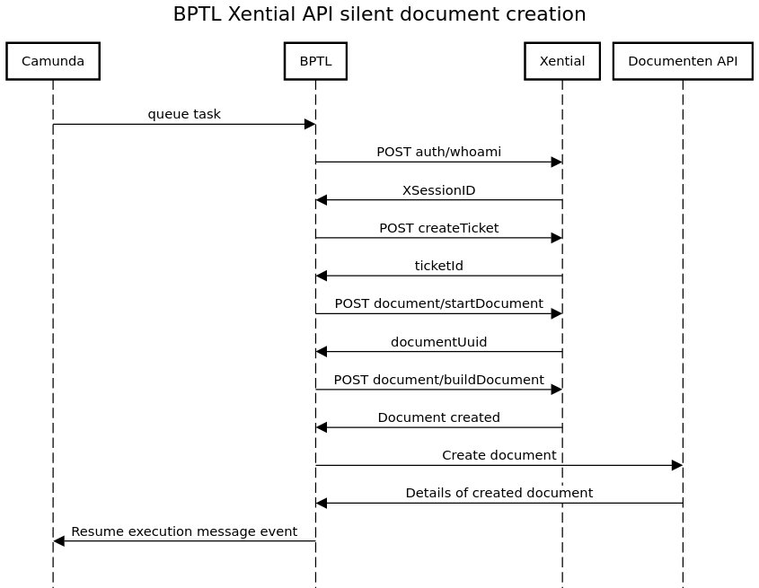
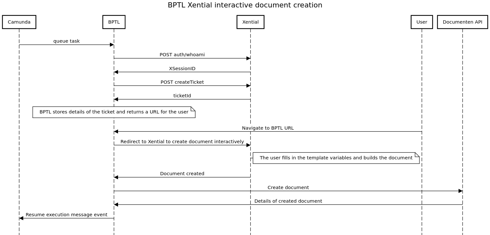

Xential
=======

Integration
-----------

BPTL can automate document creation using Xential templates.

The :func:`bptl.work_units.xential.tasks.start_xential_template` work-unit needs to know the UUID of the template to
use and whether to build the document interactively (the user fills the empty fields in the template) or
'silently'. In the latter case, values to fill the template fields also *need* to be provided to the work-unit.
For interactive documents, they *may* be provided.
Once the document is built, Xential sends it to BPTL, who then stores it in the Documenten API.

The workflow for both the interactive and silent document creation is explained in more details below.

Silent document creation
------------------------

The steps are as follows:

* BPTL requests the ``XSessionId`` from the Xential API. This is then included in every request.
* BPTL creates a ticket. The values to use to fill the template must be specified, as well as the template UUID and the URL of the webhook.
* BPTL starts the procedure to create a document. Xential returns the document UUID as well as a URL that can be used for interactively building the document (but this URL expires after 15 min).
* BPTL tells Xential to build the document. Once the document is successfully built, Xential sends it back to BPTL.
* BPTL sends the document to the Documenten API. Depending on the configuration, it can send a message to camunda to resume execution.

Interactive document creation
-----------------------------

The interactive creation of a document involves more steps:

* BPTL requests the ``XSessionId`` from the Xential API. This is then included in every request.
* BPTL creates a ticket. The template UUID and the URL of the webhook need to be specified. BPTL stores the data related to this ticket and returns a BPTL URL to the user.
* When the user navigates to the BPTL URL, BPTL starts the procedure to create a document. Like in the silent case, Xential returns the document UUID as well as a URL that can be used for interactively building the document. This URL expires after 15 min. BPTL redirects the user to the Xential URL.
* Once the user has finished filling in the template and builds the document, Xential sends the document to the BPTL webhook.
* BPTL sends the document to the Documenten API. Depending on the configuration, it can send a message to camunda to resume execution.

Failures
--------

A periodic task is configured to run every 12 hours to check for Xential errors.

Xential has an endpoint that can be queried to check the status of a particular document build. For both interactive
and silent document creation, if an error occurs during the document build Xential changes the status of the document
from ``NONE`` to ``ERROR``.

The periodic task in BPTL looks for all open tickets with an associated document UUID. It then requests the status of
each document from Xential. If any document has an ``ERROR`` status, the BPTL task is marked as failed.
